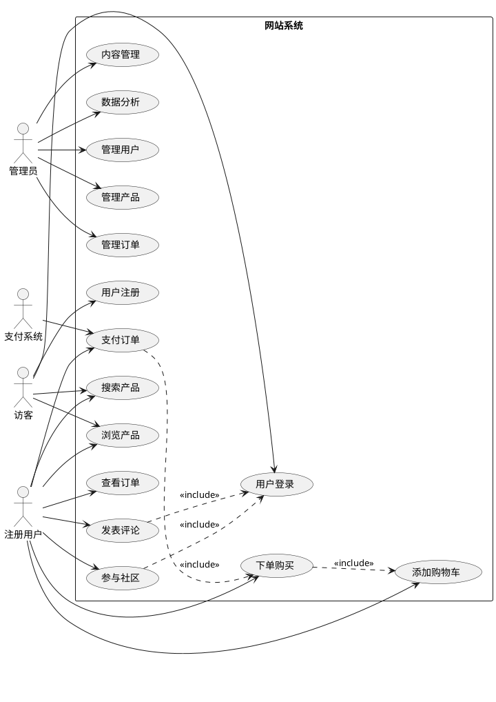
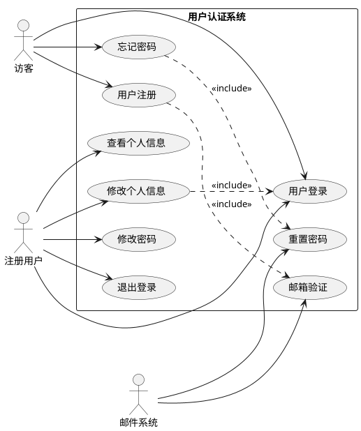
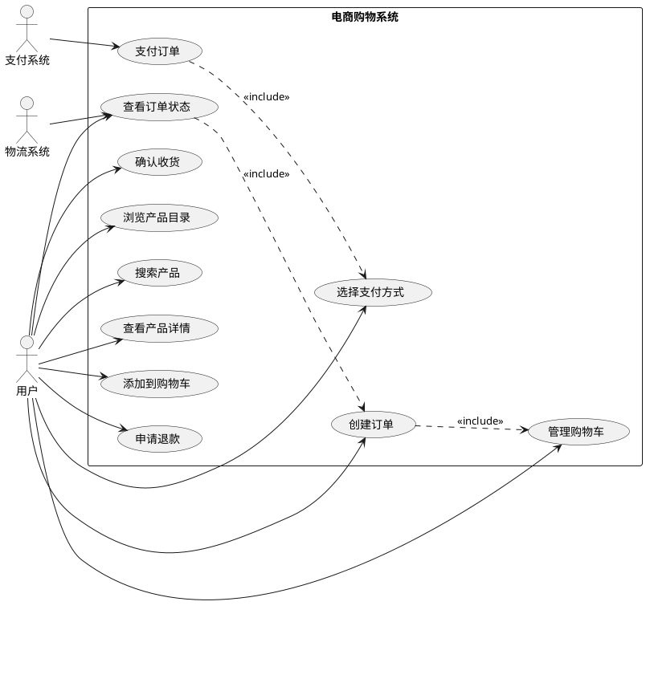
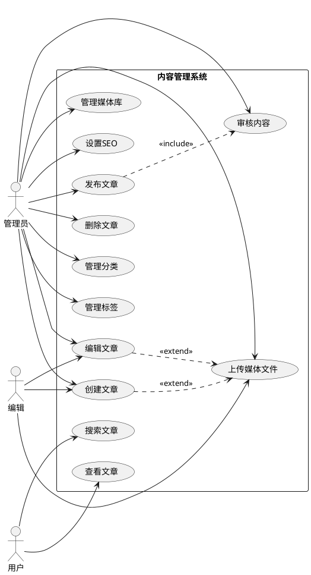
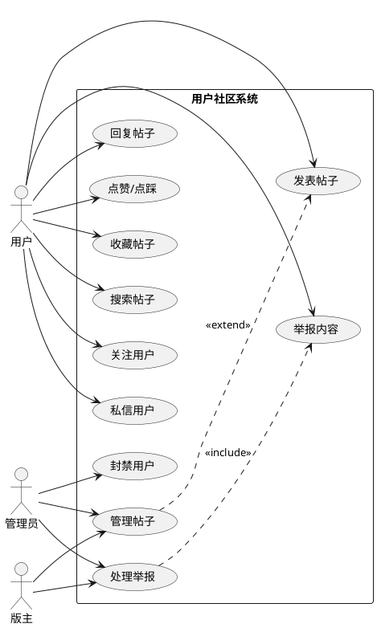
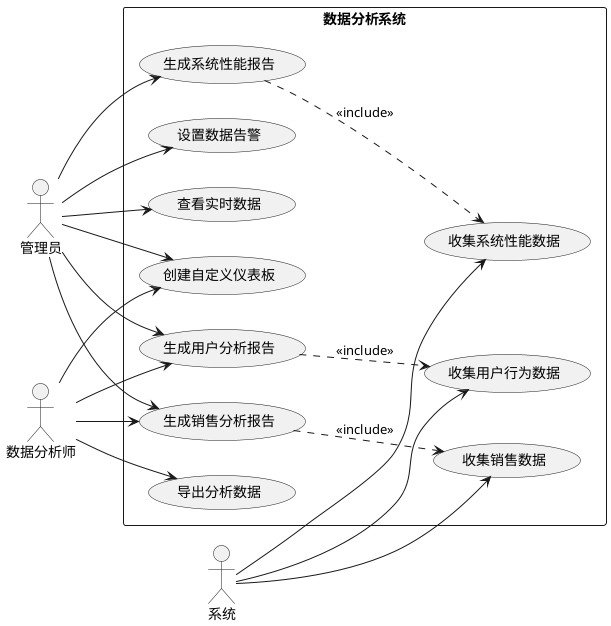

# UML用例图设计文档

## 1. 系统整体用例图

## 2. 用户认证系统用例图

## 3. 电商购物系统用例图

## 4. 内容管理系统用例图

## 5. 用户社区系统用例图

## 6. 数据分析系统用例图

## 7. 用例详细描述

### 7.1 用户注册用例

**用例名称**: 用户注册
**参与者**: 访客、邮件系统
**前置条件**: 用户未注册账号
**后置条件**: 用户成功注册并激活账号

**主要流程**:
1. 访客点击注册按钮
2. 系统显示注册表单
3. 访客填写注册信息（用户名、邮箱、密码等）
4. 系统验证信息格式和唯一性
5. 系统发送验证邮件
6. 用户点击邮件中的验证链接
7. 系统激活用户账号
8. 注册完成

**异常流程**:
- 用户名或邮箱已存在：提示用户修改
- 密码强度不够：提示密码要求
- 邮件发送失败：提供重新发送选项
- 验证链接过期：提供重新发送验证邮件

### 7.2 产品搜索用例

**用例名称**: 产品搜索
**参与者**: 用户（访客或注册用户）
**前置条件**: 系统中存在产品数据
**后置条件**: 显示搜索结果

**主要流程**:
1. 用户在搜索框输入关键词
2. 用户选择搜索条件（分类、价格范围等）
3. 用户点击搜索按钮
4. 系统执行搜索算法
5. 系统返回匹配的产品列表
6. 用户可以进一步筛选和排序结果

**异常流程**:
- 搜索无结果：显示"未找到相关产品"
- 搜索关键词为空：提示输入搜索内容
- 系统响应超时：显示错误信息并建议重试

### 7.3 订单支付用例

**用例名称**: 订单支付
**参与者**: 注册用户、支付系统
**前置条件**: 用户已创建订单
**后置条件**: 订单支付完成或失败

**主要流程**:
1. 用户选择支付方式
2. 系统生成支付订单
3. 跳转到第三方支付页面
4. 用户完成支付操作
5. 支付系统返回支付结果
6. 系统更新订单状态
7. 发送支付确认通知

**异常流程**:
- 支付失败：显示失败原因，提供重新支付选项
- 支付超时：取消支付，恢复库存
- 网络异常：提示网络错误，建议稍后重试
- 余额不足：提示充值或更换支付方式

## 8. 用例关系说明

### 8.1 包含关系 (Include)
- 下单购买包含添加购物车
- 支付订单包含创建订单
- 发表评论包含用户登录

### 8.2 扩展关系 (Extend)
- 创建文章可扩展上传媒体文件
- 编辑文章可扩展上传媒体文件
- 管理帖子可扩展创建帖子

### 8.3 泛化关系 (Generalization)
- 管理员和编辑都是内容管理者
- 访客和注册用户都是系统用户

## 9. 用例优先级

### 9.1 高优先级用例
1. 用户注册/登录
2. 产品浏览/搜索
3. 购物车管理
4. 订单创建/支付
5. 基础内容管理

### 9.2 中优先级用例
1. 用户评论系统
2. 社区功能
3. 高级搜索功能
4. 数据分析基础功能

### 9.3 低优先级用例
1. 高级数据分析
2. 复杂的社区管理
3. 个性化推荐系统
4. 多语言支持
5. 第三方集成功能

## 10. 用例实现建议

### 10.1 开发阶段划分
**第一阶段（核心功能）**
- 用户认证系统
- 产品展示和搜索
- 购物车和订单管理
- 基础支付功能

**第二阶段（扩展功能）**
- 用户评论和社区
- 内容管理系统
- 基础数据分析

**第三阶段（高级功能）**
- 高级数据分析和可视化
- 个性化推荐
- 移动端适配

### 10.2 测试用例设计
每个用例都需要对应的测试用例，包括：
- 正常流程测试
- 异常流程测试
- 边界条件测试
- 性能压力测试

### 10.3 用例追踪矩阵
建立用例与需求、设计、代码、测试之间的追踪关系，确保需求完整实现。
