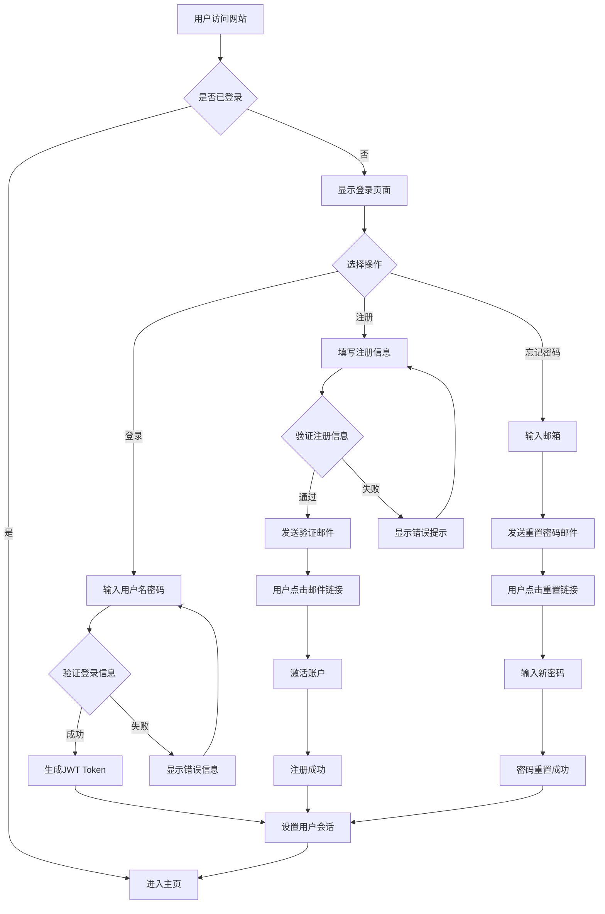
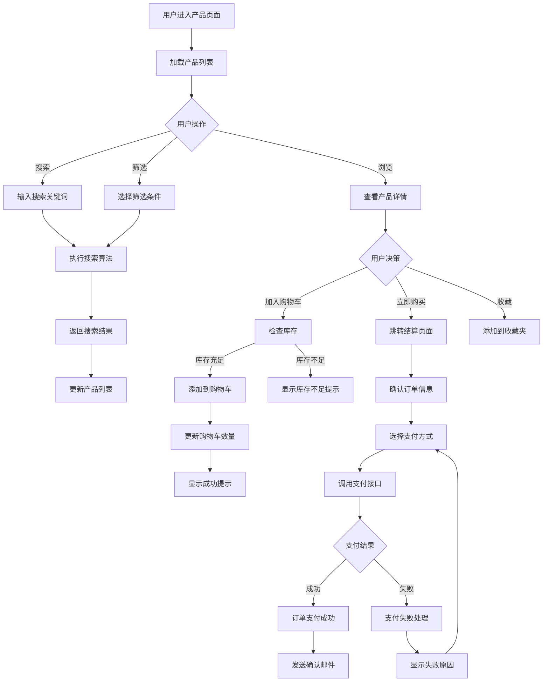
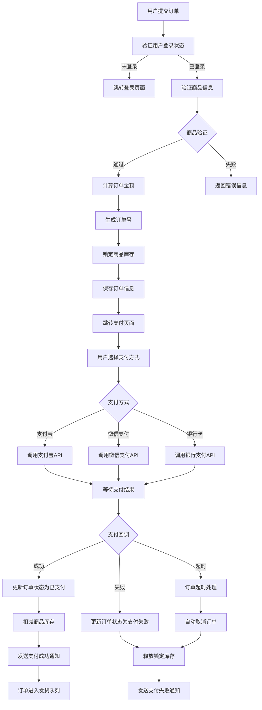
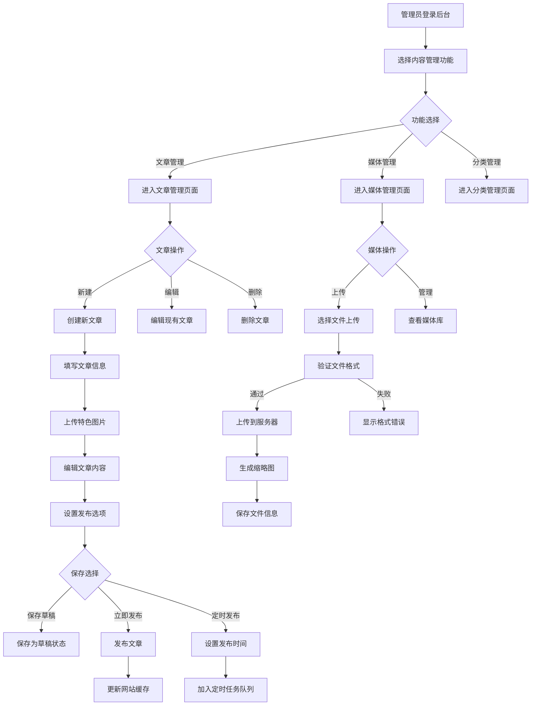
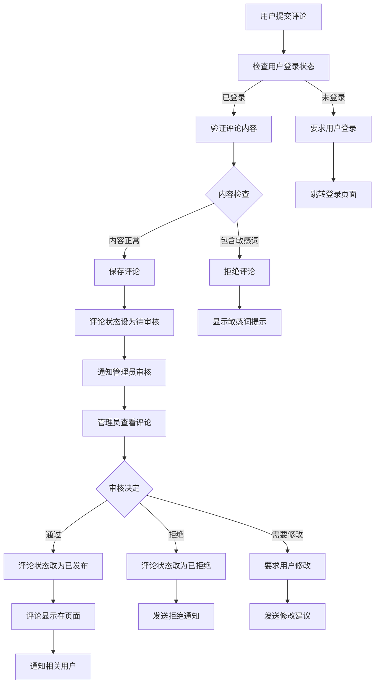
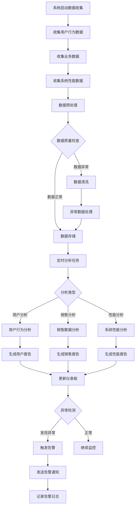
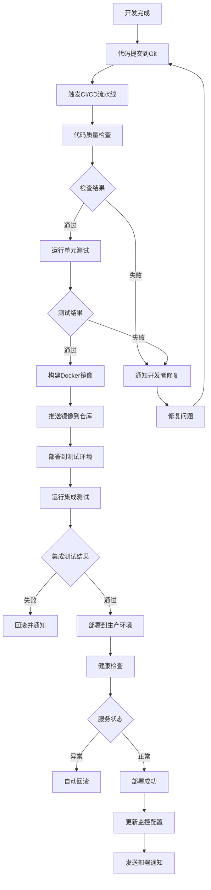
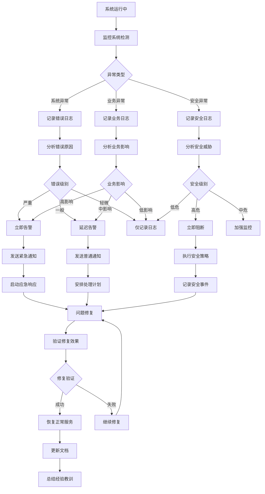
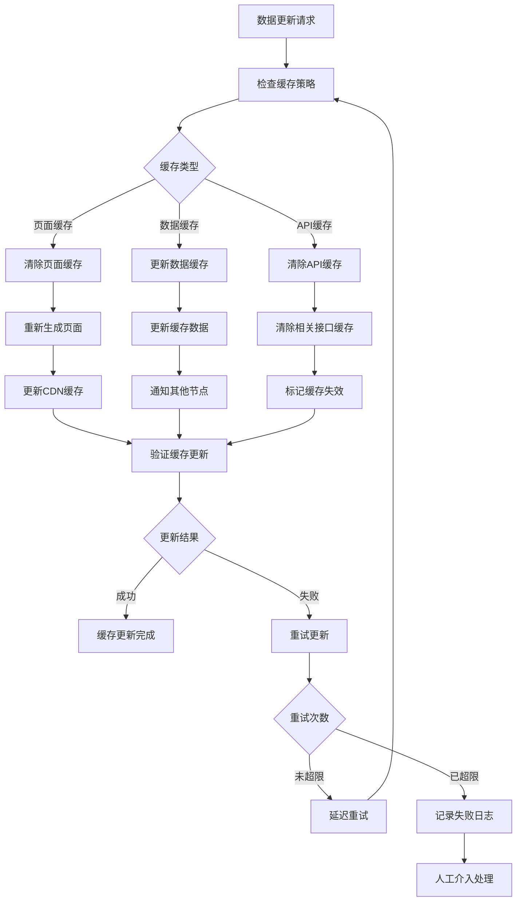
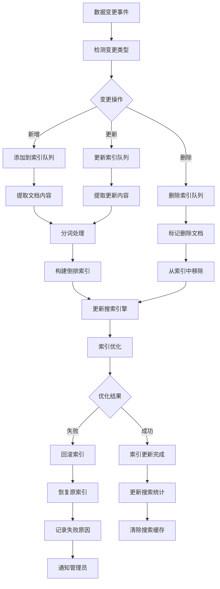

# 系统流程图设计文档

## 1. 用户注册登录流程图

## 2. 产品搜索购买流程图

## 3. 订单处理流程图

## 4. 内容管理系统流程图

## 5. 用户评论审核流程图

## 6. 数据分析处理流程图

## 7. 系统部署流程图

## 8. 异常处理流程图

## 9. 缓存更新流程图

## 10. 搜索索引更新流程图

## 11. 流程图设计原则

### 11.1 设计规范
- **统一符号**: 使用标准的流程图符号
- **清晰标注**: 每个步骤都有明确的说明
- **逻辑完整**: 覆盖所有可能的执行路径
- **异常处理**: 包含完整的异常处理流程

### 11.2 可读性要求
- **从上到下**: 主流程从上到下排列
- **从左到右**: 分支流程从左到右展开
- **颜色区分**: 不同类型的操作使用不同颜色
- **简洁明了**: 避免过于复杂的嵌套结构

### 11.3 维护更新
- **版本控制**: 流程图纳入版本管理
- **定期审查**: 定期检查流程的准确性
- **及时更新**: 业务变更时同步更新流程图
- **文档同步**: 与其他设计文档保持一致

## 12. 流程优化建议

### 12.1 性能优化
- **并行处理**: 识别可以并行执行的步骤
- **缓存机制**: 在适当位置添加缓存
- **异步处理**: 耗时操作改为异步执行
- **批量处理**: 合并相似的操作

### 12.2 用户体验优化
- **减少步骤**: 简化用户操作流程
- **智能默认**: 提供合理的默认选项
- **进度提示**: 显示操作进度
- **错误恢复**: 提供便捷的错误恢复机制

### 12.3 系统稳定性
- **容错设计**: 增加容错和重试机制
- **降级策略**: 关键服务不可用时的降级方案
- **监控告警**: 关键节点添加监控
- **自动恢复**: 自动化的故障恢复机制