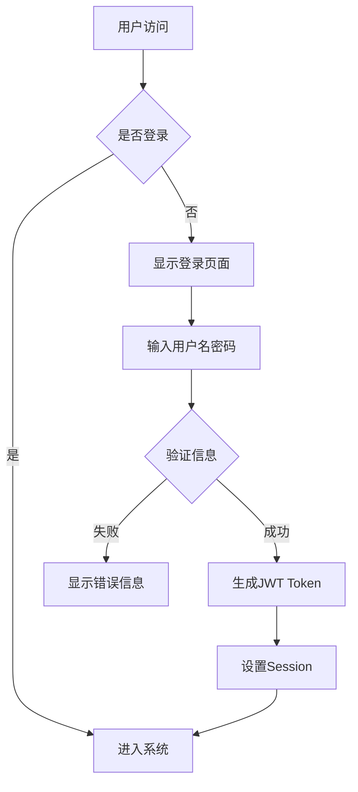
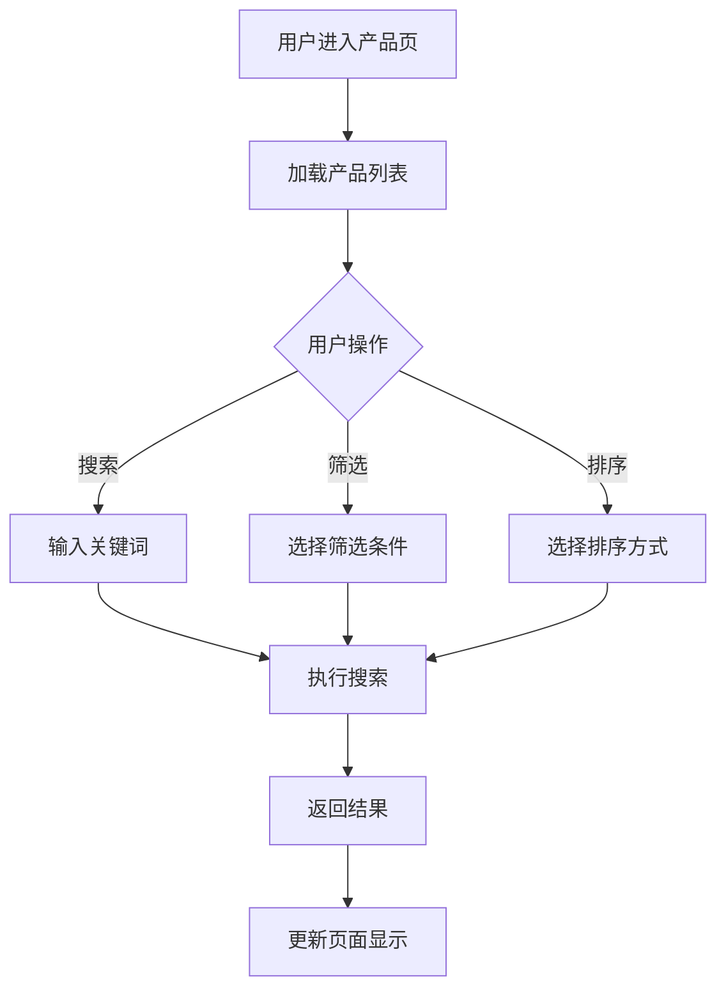
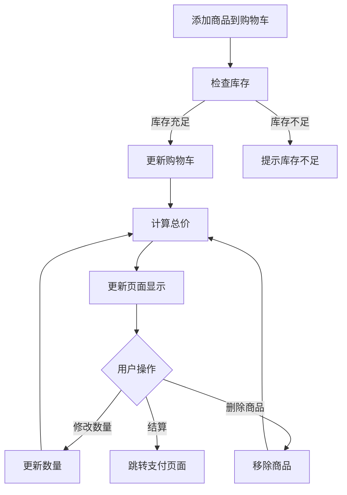
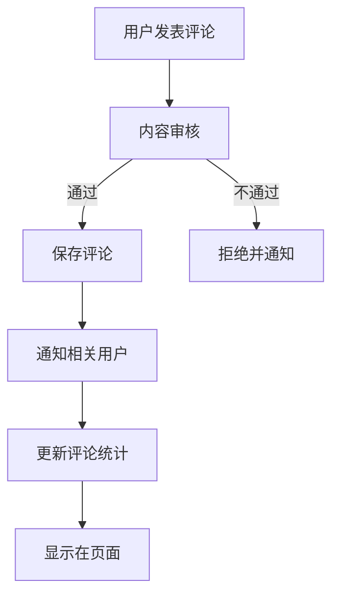

# 完整网站系统架构设计文档

## 1. 项目概述

### 1.1 系统目标
构建一个功能完善的现代化网站系统，集成电商、内容管理、用户社区和数据分析等核心功能。

### 1.2 技术栈选择
- **前端**: React.js + TypeScript + Ant Design
- **后端**: Node.js + Express + TypeScript
- **数据库**: MySQL + Redis
- **支付**: 支付宝/微信支付 SDK
- **部署**: Docker + Nginx

## 2. 系统架构图

```
┌─────────────────────────────────────────────────────────────┐
│                    前端展示层 (React)                        │
├─────────────────────────────────────────────────────────────┤
│                    API网关层 (Express)                       │
├─────────────────────────────────────────────────────────────┤
│  用户认证  │  产品管理  │  订单系统  │  内容管理  │  数据分析  │
├─────────────────────────────────────────────────────────────┤
│                    数据持久层 (MySQL + Redis)                │
└─────────────────────────────────────────────────────────────┘
```

## 3. 核心功能模块详细设计

### 3.1 网站信息架构与导航

#### 3.1.1 信息架构层次
```
首页
├── 产品中心
│   ├── 分类浏览
│   ├── 搜索结果
│   └── 产品详情
├── 用户中心
│   ├── 个人资料
│   ├── 订单管理
│   └── 收藏夹
├── 购物车
├── 社区论坛
│   ├── 话题分类
│   ├── 帖子详情
│   └── 用户互动
├── 关于我们
└── 管理后台
    ├── 用户管理
    ├── 产品管理
    ├── 订单管理
    ├── 内容管理
    └── 数据分析
```

#### 3.1.2 导航设计原则
- **一致性**: 全站统一的导航样式和交互
- **可预测性**: 用户能够预期点击后的结果
- **面包屑导航**: 清晰显示当前位置
- **响应式设计**: 适配不同设备屏幕

### 3.2 用户认证系统

#### 3.2.1 操作流程


#### 3.2.2 输入输出参数
**注册接口 POST /api/auth/register**
```json
// 输入参数
{
  "username": "string (3-20字符)",
  "email": "string (邮箱格式)",
  "password": "string (8-20字符，包含数字字母)",
  "confirmPassword": "string",
  "phone": "string (11位手机号)",
  "captcha": "string (验证码)"
}

// 输出参数
{
  "code": 200,
  "message": "注册成功",
  "data": {
    "userId": "number",
    "token": "string"
  }
}
```

#### 3.2.3 业务逻辑处理
1. **密码加密**: 使用bcrypt进行哈希处理
2. **Token管理**: JWT token有效期24小时
3. **权限控制**: 基于RBAC模型
4. **登录限制**: 5次失败后锁定账户30分钟

#### 3.2.4 异常处理机制
- 用户名重复: 返回409状态码
- 邮箱格式错误: 返回400状态码
- 密码强度不足: 返回400状态码
- 验证码错误: 返回401状态码

### 3.3 产品展示与搜索系统

#### 3.3.1 操作流程


#### 3.3.2 搜索接口参数
**产品搜索 GET /api/products/search**
```json
// 查询参数
{
  "keyword": "string (搜索关键词)",
  "category": "number (分类ID)",
  "minPrice": "number (最低价格)",
  "maxPrice": "number (最高价格)",
  "sortBy": "string (price|sales|rating)",
  "sortOrder": "string (asc|desc)",
  "page": "number (页码)",
  "pageSize": "number (每页数量)"
}

// 返回结果
{
  "code": 200,
  "data": {
    "products": [
      {
        "id": "number",
        "name": "string",
        "price": "number",
        "image": "string",
        "rating": "number",
        "sales": "number"
      }
    ],
    "total": "number",
    "page": "number",
    "pageSize": "number"
  }
}
```

#### 3.3.3 搜索算法优化
- **全文搜索**: 使用MySQL FULLTEXT索引
- **相关性排序**: 基于TF-IDF算法
- **搜索建议**: 实现自动补全功能
- **搜索统计**: 记录热门搜索词

### 3.4 购物车与支付系统

#### 3.4.1 购物车操作流程


#### 3.4.2 支付接口设计
**创建订单 POST /api/orders/create**
```json
// 输入参数
{
  "items": [
    {
      "productId": "number",
      "quantity": "number",
      "price": "number"
    }
  ],
  "shippingAddress": {
    "name": "string",
    "phone": "string",
    "address": "string",
    "city": "string",
    "province": "string"
  },
  "paymentMethod": "string (alipay|wechat|card)"
}

// 输出参数
{
  "code": 200,
  "data": {
    "orderId": "string",
    "totalAmount": "number",
    "paymentUrl": "string"
  }
}
```

#### 3.4.3 支付流程处理
1. **订单创建**: 生成唯一订单号
2. **库存锁定**: 预扣库存防止超卖
3. **支付调用**: 调用第三方支付接口
4. **回调处理**: 处理支付结果通知
5. **订单更新**: 更新订单状态

### 3.5 内容管理系统

#### 3.5.1 内容管理架构
```
内容管理系统
├── 文章管理
│   ├── 创建文章
│   ├── 编辑文章
│   ├── 发布管理
│   └── 分类标签
├── 媒体管理
│   ├── 图片上传
│   ├── 视频管理
│   └── 文件存储
├── 页面管理
│   ├── 静态页面
│   ├── 模板管理
│   └── SEO设置
└── 权限管理
    ├── 角色定义
    ├── 权限分配
    └── 审核流程
```

#### 3.5.2 文章管理接口
**创建文章 POST /api/cms/articles**
```json
// 输入参数
{
  "title": "string (文章标题)",
  "content": "string (文章内容)",
  "summary": "string (文章摘要)",
  "categoryId": "number (分类ID)",
  "tags": ["string"] (标签数组),
  "featuredImage": "string (特色图片URL)",
  "status": "string (draft|published|archived)",
  "publishTime": "datetime (发布时间)"
}
```

### 3.6 用户互动与评论系统

#### 3.6.1 评论系统设计


#### 3.6.2 评论接口设计
**发表评论 POST /api/comments**
```json
// 输入参数
{
  "targetType": "string (product|article|post)",
  "targetId": "number (目标ID)",
  "content": "string (评论内容)",
  "parentId": "number (父评论ID，可选)",
  "rating": "number (评分，1-5)"
}

// 输出参数
{
  "code": 200,
  "data": {
    "commentId": "number",
    "status": "string (pending|approved|rejected)"
  }
}
```

### 3.7 数据可视化分析平台

#### 3.7.1 数据分析维度
- **用户分析**: 注册量、活跃度、留存率
- **销售分析**: 销售额、订单量、转化率
- **产品分析**: 浏览量、收藏量、评价分析
- **内容分析**: 文章阅读量、互动数据

#### 3.7.2 可视化组件
```json
{
  "dashboards": [
    {
      "name": "用户概览",
      "charts": [
        {
          "type": "line",
          "title": "用户注册趋势",
          "dataSource": "/api/analytics/user-registration"
        },
        {
          "type": "pie",
          "title": "用户来源分布",
          "dataSource": "/api/analytics/user-source"
        }
      ]
    }
  ]
}
```

## 4. 数据库设计

### 4.1 核心数据表结构

#### 用户表 (users)
```sql
CREATE TABLE users (
    id INT PRIMARY KEY AUTO_INCREMENT,
    username VARCHAR(50) UNIQUE NOT NULL,
    email VARCHAR(100) UNIQUE NOT NULL,
    password_hash VARCHAR(255) NOT NULL,
    phone VARCHAR(20),
    avatar VARCHAR(255),
    status ENUM('active', 'inactive', 'banned') DEFAULT 'active',
    created_at TIMESTAMP DEFAULT CURRENT_TIMESTAMP,
    updated_at TIMESTAMP DEFAULT CURRENT_TIMESTAMP ON UPDATE CURRENT_TIMESTAMP
);
```

#### 产品表 (products)
```sql
CREATE TABLE products (
    id INT PRIMARY KEY AUTO_INCREMENT,
    name VARCHAR(255) NOT NULL,
    description TEXT,
    price DECIMAL(10,2) NOT NULL,
    stock_quantity INT DEFAULT 0,
    category_id INT,
    images JSON,
    status ENUM('active', 'inactive', 'out_of_stock') DEFAULT 'active',
    created_at TIMESTAMP DEFAULT CURRENT_TIMESTAMP,
    updated_at TIMESTAMP DEFAULT CURRENT_TIMESTAMP ON UPDATE CURRENT_TIMESTAMP,
    FULLTEXT(name, description)
);
```

#### 订单表 (orders)
```sql
CREATE TABLE orders (
    id INT PRIMARY KEY AUTO_INCREMENT,
    order_no VARCHAR(50) UNIQUE NOT NULL,
    user_id INT NOT NULL,
    total_amount DECIMAL(10,2) NOT NULL,
    status ENUM('pending', 'paid', 'shipped', 'delivered', 'cancelled') DEFAULT 'pending',
    shipping_address JSON,
    payment_method VARCHAR(50),
    payment_status ENUM('pending', 'paid', 'failed', 'refunded') DEFAULT 'pending',
    created_at TIMESTAMP DEFAULT CURRENT_TIMESTAMP,
    updated_at TIMESTAMP DEFAULT CURRENT_TIMESTAMP ON UPDATE CURRENT_TIMESTAMP
);
```

## 5. 安全性设计

### 5.1 数据安全
- **SQL注入防护**: 使用参数化查询
- **XSS防护**: 输入输出过滤和转义
- **CSRF防护**: 使用CSRF Token
- **数据加密**: 敏感数据加密存储

### 5.2 接口安全
- **API限流**: 防止恶意请求
- **身份验证**: JWT Token验证
- **权限控制**: 基于角色的访问控制
- **HTTPS**: 全站HTTPS加密传输

## 6. 性能优化策略

### 6.1 前端优化
- **代码分割**: 按路由分割代码
- **懒加载**: 图片和组件懒加载
- **缓存策略**: 浏览器缓存和CDN
- **压缩优化**: Gzip压缩和资源压缩

### 6.2 后端优化
- **数据库优化**: 索引优化和查询优化
- **缓存机制**: Redis缓存热点数据
- **连接池**: 数据库连接池管理
- **负载均衡**: 多实例部署和负载均衡

## 7. 部署与运维

### 7.1 部署架构
```
用户 --> Nginx --> Node.js应用 --> MySQL数据库
              |
              --> Redis缓存
```

### 7.2 监控告警
- **应用监控**: 性能指标监控
- **错误监控**: 异常日志收集
- **业务监控**: 关键业务指标
- **告警机制**: 异常情况及时通知

## 8. 项目管理建议

### 8.1 开发流程
1. **需求分析**: 详细需求文档编写
2. **技术设计**: 系统架构和接口设计
3. **开发实现**: 前后端并行开发
4. **测试验证**: 单元测试和集成测试
5. **部署上线**: 灰度发布和全量部署

### 8.2 文档管理
- 使用ONES平台统一管理项目文档
- 建立完善的文档版本控制
- 定期更新和维护技术文档
- 建立知识库便于团队协作

## 9. 风险评估与应对

### 9.1 技术风险
- **性能风险**: 高并发场景下的性能瓶颈
- **安全风险**: 数据泄露和恶意攻击
- **兼容性风险**: 不同浏览器和设备兼容

### 9.2 应对措施
- 性能测试和压力测试
- 安全审计和渗透测试
- 跨浏览器测试和响应式测试

## 10. 后续扩展规划

### 10.1 功能扩展
- 移动端APP开发
- 小程序版本开发
- AI智能推荐系统
- 多语言国际化支持

### 10.2 技术升级
- 微服务架构改造
- 容器化部署优化
- 大数据分析平台
- 机器学习算法集成