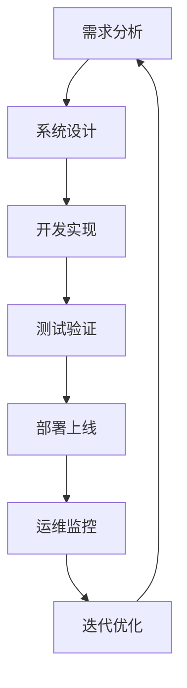

# 项目管理与操作手册

## 1. 项目管理概述

### 1.1 项目目标
构建一个功能完善、用户体验优秀的现代化网站系统，集成电商、内容管理、用户社区和数据分析等核心功能模块。

### 1.2 项目范围
- **核心功能**: 用户认证、产品展示、购物车、支付系统
- **扩展功能**: 内容管理、用户社区、数据分析
- **管理功能**: 后台管理、权限控制、系统监控
- **技术要求**: 高性能、高可用、安全稳定

### 1.3 项目约束
- **时间约束**: 项目周期6个月
- **预算约束**: 开发成本控制在预算范围内
- **技术约束**: 使用现代化技术栈，确保系统可扩展性
- **质量约束**: 代码质量、性能指标、安全标准

## 2. 项目组织架构

### 2.1 项目团队结构
```
项目经理
├── 技术负责人
│   ├── 前端开发团队 (3人)
│   ├── 后端开发团队 (4人)
│   ├── 数据库工程师 (1人)
│   └── DevOps工程师 (1人)
├── 产品经理 (1人)
├── UI/UX设计师 (2人)
├── 测试工程师 (2人)
└── 运维工程师 (1人)
```

### 2.2 角色职责

#### 项目经理
- 项目整体规划和进度管控
- 资源协调和风险管理
- 与客户沟通和需求确认
- 项目质量和交付管理

#### 技术负责人
- 技术架构设计和评审
- 技术难点攻关和解决
- 代码质量把控和技术指导
- 技术团队管理和培养

#### 产品经理
- 需求分析和产品规划
- 用户体验设计和优化
- 产品功能定义和验收
- 市场调研和竞品分析

#### 开发工程师
- 功能模块开发和实现
- 代码编写和单元测试
- 技术文档编写和维护
- Bug修复和性能优化

#### 测试工程师
- 测试计划制定和执行
- 功能测试和性能测试
- 自动化测试脚本编写
- 缺陷跟踪和质量报告

## 3. 项目开发流程

### 3.1 开发生命周期


### 3.2 开发阶段划分

#### 第一阶段：基础功能开发 (2个月)
**目标**: 完成核心功能模块开发
**交付物**:
- 用户认证系统
- 产品展示和搜索
- 购物车和订单管理
- 基础支付功能

**里程碑**:
- Week 2: 用户认证系统完成
- Week 4: 产品展示功能完成
- Week 6: 购物车功能完成
- Week 8: 支付系统集成完成

#### 第二阶段：扩展功能开发 (2个月)
**目标**: 完成扩展功能模块开发
**交付物**:
- 内容管理系统
- 用户社区功能
- 评论和互动系统
- 基础数据分析

**里程碑**:
- Week 10: 内容管理系统完成
- Week 12: 社区功能完成
- Week 14: 评论系统完成
- Week 16: 数据分析功能完成

#### 第三阶段：系统优化和上线 (2个月)
**目标**: 系统优化、测试和部署上线
**交付物**:
- 性能优化和安全加固
- 全面测试和Bug修复
- 部署环境搭建
- 系统上线和监控

**里程碑**:
- Week 18: 性能优化完成
- Week 20: 系统测试完成
- Week 22: 部署环境就绪
- Week 24: 系统正式上线

### 3.3 开发规范

#### 代码规范
- **命名规范**: 使用有意义的变量和函数名
- **注释规范**: 关键逻辑添加详细注释
- **格式规范**: 统一代码格式和缩进
- **模块化**: 合理拆分模块和组件

#### Git工作流
```
main (生产环境)
├── develop (开发环境)
│   ├── feature/user-auth (功能分支)
│   ├── feature/product-display (功能分支)
│   └── feature/shopping-cart (功能分支)
├── release/v1.0 (发布分支)
└── hotfix/critical-bug (热修复分支)
```

#### 代码审查流程
1. 开发者提交Pull Request
2. 指定审查者进行代码审查
3. 审查通过后合并到develop分支
4. 自动触发CI/CD流水线
5. 部署到测试环境进行验证

## 4. 质量管理体系

### 4.1 质量标准

#### 功能质量
- **功能完整性**: 所有需求功能正确实现
- **业务逻辑**: 业务流程符合设计要求
- **用户体验**: 界面友好，操作便捷
- **兼容性**: 支持主流浏览器和设备

#### 技术质量
- **代码质量**: 代码规范，结构清晰
- **性能指标**: 页面加载时间<3秒
- **安全标准**: 通过安全测试和审计
- **可维护性**: 代码易于理解和修改

### 4.2 测试策略

#### 测试类型
- **单元测试**: 覆盖率>80%
- **集成测试**: 模块间接口测试
- **系统测试**: 端到端功能测试
- **性能测试**: 负载和压力测试
- **安全测试**: 漏洞扫描和渗透测试

#### 测试环境
```
开发环境 (DEV)
├── 功能开发和调试
└── 单元测试执行

测试环境 (TEST)
├── 集成测试
├── 系统测试
└── 性能测试

预生产环境 (STAGING)
├── 用户验收测试
├── 安全测试
└── 上线前验证

生产环境 (PROD)
├── 正式服务
└── 监控告警
```

### 4.3 缺陷管理

#### 缺陷分级
- **P0 (阻塞)**: 系统无法使用，影响核心功能
- **P1 (严重)**: 主要功能异常，影响用户体验
- **P2 (一般)**: 次要功能问题，不影响主流程
- **P3 (轻微)**: 界面问题或优化建议

#### 缺陷处理流程
1. **发现**: 测试人员发现并记录缺陷
2. **分析**: 开发人员分析缺陷原因
3. **修复**: 开发人员修复缺陷
4. **验证**: 测试人员验证修复效果
5. **关闭**: 确认修复后关闭缺陷

## 5. 风险管理

### 5.1 风险识别

#### 技术风险
- **技术选型风险**: 新技术学习成本和稳定性
- **性能风险**: 高并发场景下的性能瓶颈
- **安全风险**: 数据泄露和恶意攻击
- **集成风险**: 第三方服务集成失败

#### 项目风险
- **进度风险**: 开发进度延迟
- **资源风险**: 人员流失或技能不足
- **需求风险**: 需求变更频繁
- **质量风险**: 质量不达标影响上线

### 5.2 风险应对策略

#### 技术风险应对
- **技术调研**: 充分调研技术方案的可行性
- **原型验证**: 关键技术提前验证
- **备选方案**: 准备技术备选方案
- **专家咨询**: 寻求技术专家指导

#### 项目风险应对
- **进度监控**: 定期检查项目进度
- **资源储备**: 准备备用人员和资源
- **需求管控**: 严格控制需求变更
- **质量把关**: 建立质量检查机制

### 5.3 风险监控

#### 风险指标
- **进度偏差率**: 实际进度与计划进度的偏差
- **缺陷密度**: 单位代码的缺陷数量
- **人员流失率**: 项目团队人员流失比例
- **需求变更率**: 需求变更的频率和影响

#### 风险报告
- **周报**: 每周风险状态更新
- **月报**: 月度风险分析和趋势
- **里程碑报告**: 关键节点风险评估
- **项目总结**: 项目结束后风险回顾

## 6. 沟通管理

### 6.1 沟通计划

#### 会议安排
- **日站会**: 每日15分钟，同步进度和问题
- **周例会**: 每周1小时，回顾进展和计划
- **月度会**: 每月2小时，项目总结和规划
- **里程碑会**: 关键节点，成果展示和评审

#### 沟通渠道
- **即时通讯**: 微信群、钉钉群日常沟通
- **邮件**: 正式通知和文档分享
- **视频会议**: 远程会议和技术讨论
- **项目管理工具**: ONES平台任务跟踪

### 6.2 文档管理

#### 文档分类
- **需求文档**: 需求规格说明书
- **设计文档**: 系统架构和详细设计
- **开发文档**: API文档和代码说明
- **测试文档**: 测试计划和测试报告
- **运维文档**: 部署和运维手册

#### 文档规范
- **模板统一**: 使用统一的文档模板
- **版本控制**: 文档版本管理和变更记录
- **审核流程**: 文档编写、审核、发布流程
- **存储管理**: 统一存储在ONES平台

### 6.3 知识管理

#### 知识库建设
- **技术知识库**: 技术方案和最佳实践
- **业务知识库**: 业务流程和规则说明
- **问题知识库**: 常见问题和解决方案
- **经验知识库**: 项目经验和教训总结

#### 知识分享
- **技术分享会**: 定期技术交流和分享
- **代码评审**: 通过代码评审传播知识
- **文档沉淀**: 及时记录和分享经验
- **培训计划**: 针对性的技能培训

## 7. 配置管理

### 7.1 版本控制

#### Git仓库结构
```
project-root/
├── frontend/          # 前端代码
├── backend/           # 后端代码
├── database/          # 数据库脚本
├── docs/              # 项目文档
├── tests/             # 测试代码
├── deployment/        # 部署脚本
└── tools/             # 工具脚本
```

#### 分支管理策略
- **main分支**: 生产环境代码，只接受release和hotfix合并
- **develop分支**: 开发环境代码，功能开发的集成分支
- **feature分支**: 功能开发分支，从develop分出，完成后合并回develop
- **release分支**: 发布准备分支，从develop分出，测试完成后合并到main
- **hotfix分支**: 紧急修复分支，从main分出，修复后合并到main和develop

### 7.2 构建管理

#### CI/CD流水线
```yaml
# .github/workflows/ci-cd.yml
name: CI/CD Pipeline

on:
  push:
    branches: [main, develop]
  pull_request:
    branches: [main, develop]

jobs:
  test:
    runs-on: ubuntu-latest
    steps:
      - uses: actions/checkout@v2
      - name: Setup Node.js
        uses: actions/setup-node@v2
        with:
          node-version: '16'
      - name: Install dependencies
        run: npm install
      - name: Run tests
        run: npm test
      - name: Run linting
        run: npm run lint

  build:
    needs: test
    runs-on: ubuntu-latest
    steps:
      - uses: actions/checkout@v2
      - name: Build application
        run: npm run build
      - name: Build Docker image
        run: docker build -t app:${{ github.sha }} .

  deploy:
    needs: build
    runs-on: ubuntu-latest
    if: github.ref == 'refs/heads/main'
    steps:
      - name: Deploy to production
        run: |
          # 部署脚本
```

### 7.3 环境管理

#### 环境配置
```javascript
// config/environments.js
const environments = {
  development: {
    database: {
      host: 'localhost',
      port: 3306,
      name: 'website_dev'
    },
    redis: {
      host: 'localhost',
      port: 6379
    },
    api: {
      baseUrl: 'http://localhost:3000'
    }
  },
  
  test: {
    database: {
      host: 'test-db.example.com',
      port: 3306,
      name: 'website_test'
    },
    redis: {
      host: 'test-redis.example.com',
      port: 6379
    },
    api: {
      baseUrl: 'http://test-api.example.com'
    }
  },
  
  production: {
    database: {
      host: process.env.DB_HOST,
      port: process.env.DB_PORT,
      name: process.env.DB_NAME
    },
    redis: {
      host: process.env.REDIS_HOST,
      port: process.env.REDIS_PORT
    },
    api: {
      baseUrl: process.env.API_BASE_URL
    }
  }
};
```

## 8. 部署运维手册

### 8.1 部署架构

#### 生产环境架构
```
Internet
    ↓
Load Balancer (Nginx)
    ↓
┌─────────────────────────────────┐
│  Web Server Cluster             │
│  ┌─────────┐ ┌─────────┐       │
│  │ Node.js │ │ Node.js │       │
│  │ App 1   │ │ App 2   │       │
│  └─────────┘ └─────────┘       │
└─────────────────────────────────┘
    ↓
┌─────────────────────────────────┐
│  Database Cluster               │
│  ┌─────────┐ ┌─────────┐       │
│  │ MySQL   │ │ MySQL   │       │
│  │ Master  │ │ Slave   │       │
│  └─────────┘ └─────────┘       │
└─────────────────────────────────┘
    ↓
┌─────────────────────────────────┐
│  Cache Cluster                  │
│  ┌─────────┐ ┌─────────┐       │
│  │ Redis   │ │ Redis   │       │
│  │ Master  │ │ Slave   │       │
│  └─────────┘ └─────────┘       │
└─────────────────────────────────┘
```

### 8.2 部署步骤

#### 自动化部署脚本
```bash
#!/bin/bash
# deploy.sh

set -e

echo "开始部署..."

# 1. 拉取最新代码
git pull origin main

# 2. 安装依赖
npm install --production

# 3. 构建前端资源
npm run build

# 4. 数据库迁移
npm run migrate

# 5. 重启应用服务
pm2 restart ecosystem.config.js

# 6. 健康检查
sleep 10
curl -f http://localhost:3000/health || exit 1

echo "部署完成！"
```

#### Docker部署
```dockerfile
# Dockerfile
FROM node:16-alpine

WORKDIR /app

COPY package*.json ./
RUN npm install --production

COPY . .
RUN npm run build

EXPOSE 3000

CMD ["npm", "start"]
```

```yaml
# docker-compose.yml
version: '3.8'

services:
  app:
    build: .
    ports:
      - "3000:3000"
    environment:
      - NODE_ENV=production
      - DB_HOST=db
      - REDIS_HOST=redis
    depends_on:
      - db
      - redis

  db:
    image: mysql:8.0
    environment:
      - MYSQL_ROOT_PASSWORD=password
      - MYSQL_DATABASE=website
    volumes:
      - db_data:/var/lib/mysql

  redis:
    image: redis:6-alpine
    volumes:
      - redis_data:/data

volumes:
  db_data:
  redis_data:
```

### 8.3 监控告警

#### 系统监控指标
- **服务器指标**: CPU、内存、磁盘、网络使用率
- **应用指标**: 响应时间、吞吐量、错误率
- **数据库指标**: 连接数、查询性能、锁等待
- **业务指标**: 用户活跃度、订单量、支付成功率

#### 告警规则配置
```yaml
# alerting.yml
groups:
  - name: website-alerts
    rules:
      - alert: HighCPUUsage
        expr: cpu_usage_percent > 80
        for: 5m
        labels:
          severity: warning
        annotations:
          summary: "CPU使用率过高"
          description: "CPU使用率超过80%，持续5分钟"

      - alert: HighResponseTime
        expr: http_request_duration_seconds > 3
        for: 2m
        labels:
          severity: critical
        annotations:
          summary: "响应时间过长"
          description: "HTTP请求响应时间超过3秒"

      - alert: DatabaseConnectionError
        expr: mysql_up == 0
        for: 1m
        labels:
          severity: critical
        annotations:
          summary: "数据库连接失败"
          description: "无法连接到MySQL数据库"
```

### 8.4 备份恢复

#### 数据备份策略
- **全量备份**: 每日凌晨进行全量数据备份
- **增量备份**: 每小时进行增量备份
- **日志备份**: 实时备份事务日志
- **文件备份**: 定期备份上传文件和配置文件

#### 备份脚本
```bash
#!/bin/bash
# backup.sh

DATE=$(date +%Y%m%d_%H%M%S)
BACKUP_DIR="/backup"
DB_NAME="website"

# 数据库备份
mysqldump -u root -p$MYSQL_PASSWORD $DB_NAME > $BACKUP_DIR/db_$DATE.sql

# 文件备份
tar -czf $BACKUP_DIR/files_$DATE.tar.gz /app/uploads

# 清理旧备份（保留30天）
find $BACKUP_DIR -name "*.sql" -mtime +30 -delete
find $BACKUP_DIR -name "*.tar.gz" -mtime +30 -delete

echo "备份完成: $DATE"
```

## 9. 安全管理

### 9.1 安全策略

#### 数据安全
- **数据加密**: 敏感数据加密存储
- **传输加密**: HTTPS全站加密
- **访问控制**: 基于角色的权限控制
- **数据脱敏**: 测试环境数据脱敏

#### 应用安全
- **输入验证**: 严格验证用户输入
- **SQL注入防护**: 使用参数化查询
- **XSS防护**: 输出内容转义
- **CSRF防护**: 使用CSRF Token

#### 系统安全
- **服务器加固**: 关闭不必要的服务和端口
- **防火墙配置**: 配置网络防火墙规则
- **入侵检测**: 部署入侵检测系统
- **安全审计**: 定期进行安全审计

### 9.2 安全检查清单

#### 开发阶段
- [ ] 代码安全审查
- [ ] 依赖包漏洞扫描
- [ ] 静态代码分析
- [ ] 安全编码规范遵循

#### 测试阶段
- [ ] 安全测试用例执行
- [ ] 渗透测试
- [ ] 漏洞扫描
- [ ] 安全配置检查

#### 部署阶段
- [ ] 生产环境安全配置
- [ ] SSL证书配置
- [ ] 访问控制设置
- [ ] 监控告警配置

#### 运维阶段
- [ ] 定期安全更新
- [ ] 日志监控分析
- [ ] 安全事件响应
- [ ] 备份恢复测试

## 10. 项目总结与改进

### 10.1 项目回顾

#### 成功因素
- **需求管理**: 需求分析充分，变更控制有效
- **技术选型**: 技术方案合理，架构设计良好
- **团队协作**: 团队配合默契，沟通顺畅
- **质量控制**: 测试覆盖全面，质量标准严格

#### 改进点
- **进度管理**: 部分模块开发进度滞后
- **风险控制**: 某些技术风险预估不足
- **文档管理**: 文档更新不够及时
- **知识传承**: 知识分享机制需要完善

### 10.2 经验总结

#### 技术经验
- **架构设计**: 微服务架构提高了系统的可扩展性
- **性能优化**: 缓存策略和数据库优化效果显著
- **安全防护**: 多层安全防护机制保障了系统安全
- **运维自动化**: CI/CD流水线提高了部署效率

#### 管理经验
- **敏捷开发**: 敏捷开发方法提高了响应速度
- **质量管理**: 严格的质量管理确保了交付质量
- **风险管理**: 前瞻性的风险管理避免了重大问题
- **团队建设**: 良好的团队氛围促进了项目成功

### 10.3 持续改进

#### 流程优化
- **开发流程**: 优化开发流程，提高开发效率
- **测试流程**: 完善测试流程，提高测试质量
- **部署流程**: 自动化部署流程，减少人工错误
- **运维流程**: 标准化运维流程，提高运维效率

#### 工具改进
- **开发工具**: 引入更好的开发工具和IDE插件
- **测试工具**: 完善自动化测试工具链
- **监控工具**: 升级监控工具，提高监控能力
- **协作工具**: 优化团队协作工具配置

#### 能力提升
- **技术能力**: 持续学习新技术，提升技术水平
- **管理能力**: 加强项目管理能力培养
- **沟通能力**: 提高团队沟通和协作能力
- **创新能力**: 鼓励技术创新和最佳实践分享

## 11. 附录

### 11.1 项目模板

#### 需求文档模板
```markdown
# 需求规格说明书

## 1. 项目概述
### 1.1 项目背景
### 1.2 项目目标
### 1.3 项目范围

## 2. 功能需求
### 2.1 用户角色
### 2.2 功能列表
### 2.3 用例描述

## 3. 非功能需求
### 3.1 性能需求
### 3.2 安全需求
### 3.3 可用性需求

## 4. 约束条件
### 4.1 技术约束
### 4.2 时间约束
### 4.3 资源约束
```

#### 设计文档模板
```markdown
# 系统设计文档

## 1. 系统架构
### 1.1 整体架构
### 1.2 技术栈选择
### 1.3 部署架构

## 2. 详细设计
### 2.1 数据库设计
### 2.2 API设计
### 2.3 界面设计

## 3. 安全设计
### 3.1 认证授权
### 3.2 数据安全
### 3.3 通信安全
```

### 11.2 检查清单

#### 代码提交检查清单
- [ ] 代码符合编码规范
- [ ] 添加了必要的注释
- [ ] 通过了单元测试
- [ ] 没有明显的性能问题
- [ ] 没有安全漏洞
- [ ] 更新了相关文档

#### 发布前检查清单
- [ ] 所有功能测试通过
- [ ] 性能测试达标
- [ ] 安全测试通过
- [ ] 数据库迁移脚本准备
- [ ] 回滚方案准备
- [ ] 监控告警配置

### 11.3 常用命令

#### Git命令
```bash
# 创建功能分支
git checkout -b feature/new-feature

# 提交代码
git add .
git commit -m "feat: add new feature"

# 推送分支
git push origin feature/new-feature

# 合并分支
git checkout develop
git merge feature/new-feature
```

#### Docker命令
```bash
# 构建镜像
docker build -t website:latest .

# 运行容器
docker run -d -p 3000:3000 website:latest

# 查看日志
docker logs container_id

# 进入容器
docker exec -it container_id /bin/bash
```

#### 数据库命令
```sql
-- 创建数据库
CREATE DATABASE website CHARACTER SET utf8mb4 COLLATE utf8mb4_unicode_ci;

-- 创建用户
CREATE USER 'website'@'%' IDENTIFIED BY 'password';
GRANT ALL PRIVILEGES ON website.* TO 'website'@'%';

-- 备份数据库
mysqldump -u root -p website > backup.sql

-- 恢复数据库
mysql -u root -p website < backup.sql
```

这份完整的项目管理与操作手册为网站系统的开发、部署和运维提供了全面的指导，确保项目能够按照规范和标准顺利进行。